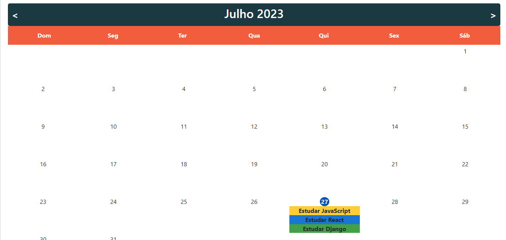
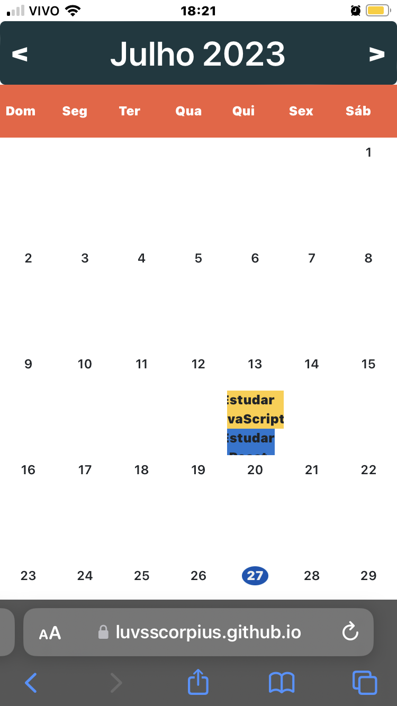

# Basic Google Calendar - Calendário Interativo

## Descrição 

O Basic Google Calendar é um software que permite aos usuários gerenciar eventos e tarefas em um calendário interativo. Ele oferece funcionalidades para adicionar, atualizar e excluir eventos, além de exibir os eventos de forma organizada em um calendário.

## Demonstração

Aqui estão algumas capturas de tela do software em funcionamento.

## Funcionalidades

- Adicionar eventos: O usuário pode adicionar eventos ao selecionar uma data, fornecer um título e escolher uma cor associada ao evento.
- Atualizar eventos: Os eventos existentes podem ser atualizadas pelo usuário. É possível modificar a data, o título e a cor de um evento ja registrado.
- Excluir eventos: Caso um evento não seja mais necessário, o usuário pode excluí-lo do calendário.

## Tecnologias Utilizadas

- HTML
- CSS 
- Bootstrap
- JavaScript

## Uso 

1. Ao carregar o calendário, o mês atual é exibido com os dias disponíveis.
2. Para adicionar um novo evento, siga os passos abaixo:
    - Clique no dia do evento desejado no calendário.
    - Preencha o título do evento.
    - Selecione uma cor para o evento.
    - Escolha a data e hora do evento.
    - Clique no botão salvar.
3. Para atualizar um evento existente, siga os passos abaixo:
    - Clique no evento que deseja alterar.
    - Será exibida uma janela modal para editar o título, cor e data do evento.
    - Após fazer as alterações, clique no botão "Salvar".
4. Para excluir um evento existente, siga os passos abaixo:
    - Clique no evento que deseja excluir.
    - Será exibida uma janela modal com as informações do evento.
    - Clique no botão (icone) de excluir para remover o evento do calendário.

## Como contribuir

Se desejar contribuir com o projeto, siga os passos abaixo:

1. Faça um fork deste repositório.
2. Crie uma branch para a sua contribuição: git checkout -b minha-contribuicao.
3. Faça as alterações desejadas e adicione-as: git add .
4. Faça um commit das suas alterações: git commit -m "Minha contribuição: descrição das alterações".
5. Faça um push para a branch: git push origin minha-contribuicao.
6. Abra um pull request para a branch principal deste repositório.

Agradecemos antecipadamente por sua contribuição.